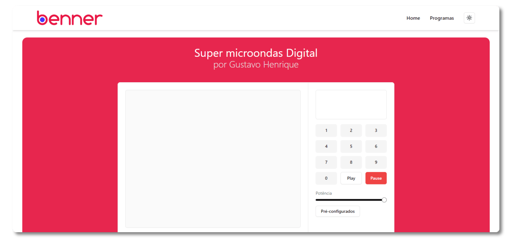

<h1 align="center"><div align="center"></div>Teste para Desenvolvedor Trainee</h1>

<p align="center">
    
    
    
    
</p>

<p align="center"></p>

## :page_with_curl: Descrição
Este projeto consiste na implementação de um micro-ondas digital utilizando conceitos de orientação a objetos e C# (.NET Framework 4.0 ou superior). O desenvolvimento está estruturado em níveis de dificuldade, onde cada nível expande as funcionalidades anteriores, atendendo a requisitos obrigatórios e desejáveis, como a aplicação dos princípios SOLID e boas práticas de código.

## :dart: Níveis
- [x] Nível 1 - UI do Microondas
- [x] Nível 2 - Programas de aquecimento pré-definidos
- [x] Nível 3 - Programas de aquecimento customizados
- [x] Nível 4 - Web API

## :bulb: Resolvendo o desafio
No desenvolvimento do micro-ondas, adotei uma abordagem que se baseia na definição de duas entidades principais: `HeatingTask` e `HeatingProgram`. Essa abordagem permitiu controlar o estado das minhas "Tasks" através de endpoints, concentrando toda a lógica de negócios na API.

<p align="center"></p>

## :pushpin: Requisitos
- [Visual Studio Code](https://visualstudio.microsoft.com/vs/)
- [Node.js](https://nodejs.org/en)

## :gear: Rodando localmente

Faça o [Download](https://github.com/Gustavohps10/microwave-benner/archive/refs/heads/main.zip) ou bifurque e clone este repositório
```
git clone https://github.com/<your-profile>/microwave-benner
```
### Database
Inicie o banco de dados PostgreSQL
```
docker-compose up -d db
```
Você também vai precisar aplicar as migrations com Entity Framework
```
dotnet ef database update --project ./microwave-benner.Infra.Data/microwave-benner.Infra.Data.csproj --startup-project ./microwave-benner.Server/microwave-benner.Server.csproj
```

### Executando Frontend e Backend
Inicie a API e o client em React 
```
dotnet run --project ./microwave-benner.Server/microwave-benner.Server.csproj
```
Abra no seu navegador `http://localhost:5173/` e voilà


## :hammer_and_wrench: Ferramentas utilizadas
#### Frontend
<p>


</p>

#### Backend
<p>

    
    


</p>

## :bookmark_tabs: Licença
Este projeto está sob licença MIT. Consulte ```LICENSE``` para mais informações.

## :adult: Autores

<!-- ALL-CONTRIBUTORS-LIST:START - Do not remove or modify this section -->
<!-- prettier-ignore-start -->
<!-- markdownlint-disable -->
<table>
  <tbody>
    <tr>
      <td align="center" valign="top" width="14.28%"><a href="https://gustavohenrique.vercel.app/"><br /><sub><b>Gustavo Henrique</b></sub></a><br /><a href="#code-Gustavohps10" title="Code">💻</a></td>
    </tr>
  </tbody>
</table>

<!-- markdownlint-restore -->
<!-- prettier-ignore-end -->

<!-- ALL-CONTRIBUTORS-LIST:END -->
